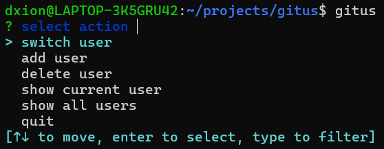

A small fun project I decided to build to learn Rust. The core goal was to quickly switch between Git user profiles, to not manually run `git config user.name` and `git config user.email` each time. 

The actions gitus can perform is displayed above when running the command without any arguments. The commands are self-explanatory. It's possible to pass arguments with the command - the associated [README.md](https://github.com/daxog/gitus) has more information. 

Feel free to use it and add any pull requests or issues. 

*Medium rare? Hmm, an aristocrat.*
