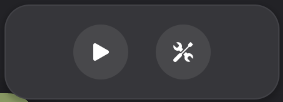
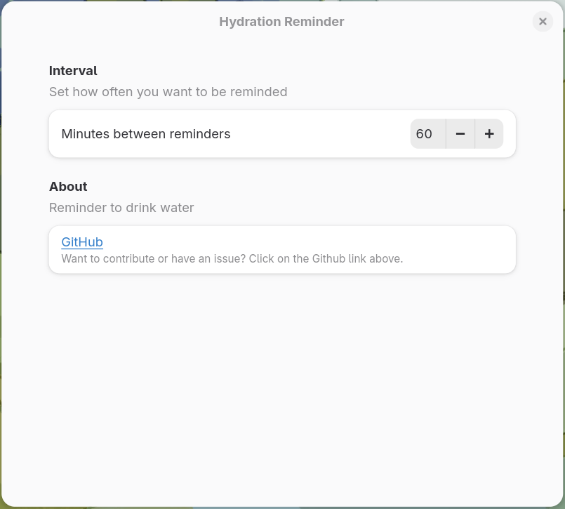

A GNOME shell extension that notifies users to take a break and stay hydrated. I often forget to drink enough water, so this prods me to get up and hydrate. The initial idea and implementation was a timer-triggered oneshot service - [wamind](https://github.com/daxog/wamind), but the reminder lacked a user interface. Given I was already using GNOME, building a shell extension felt like the most straightforward approach. And it turned out to be fairly interesting, learning and working with the GNOME shell and GNOME JavaScript.

Consists of a popup with a start/stop toggle button and a preferences button.

Users can adjust the reminder interval in the preferences window, with a minimum of 1 and a maximum of 180 minutes. When the extension's enabled, desktop notifications are triggered through a GLib timer at the configured interval.

*Deserves got nothin' to do with it.*
